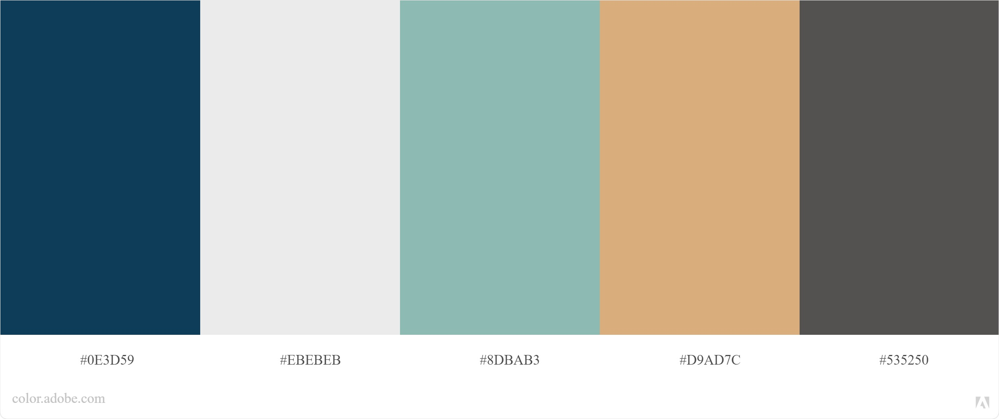

# Loja Amigulovers

Este é um projeto de e-commerce desenvolvido com HTML e CSS.

## Funcionalidades

- [x] Vitrine virtual de produtos;
- [x] Página com detalhes do produto;
- [x] Filtro de acordo com a categoria do produto;
- [x] Página institucional;
- [x] Responsividade para as dimensões:
  - [x] Desktop (1280px);
  - [x] Tablet (1024px);
  - [x] Celular (375px).

## Design

Para o desenvolvimento do site foi estipulado uma paleta de cores com o objetivo de harmonizar o design. A paleta foi criada através do site [Adobe Color](https://color.adobe.com/pt/create/color-wheel).

## Logo

A logo foi criada exclusivamente para ser utilizada no desenvolvimento do projeto através do site [My Free Logo Maker](https://myfreelogomaker.com/).

## Como executar o projeto

1. Faça o download do projeto;
2. Utilizando o VSCode instale a extensão "Live Server";
3. Clique com o botão direito do mouse no arquivo `index.html`;
4. Selecione a opção "Open with Live Server".

## Estrutura do projeto

O código fonte é subdividido em três pastas principais:

| Pasta | Descrição |
| --- | --- |
| `src/css` | Arquivos CSS de todas as páginas. |
| `src/html` | Arquivos HTML de todas as páginas. |
| `src/img` | Imagens do site. |